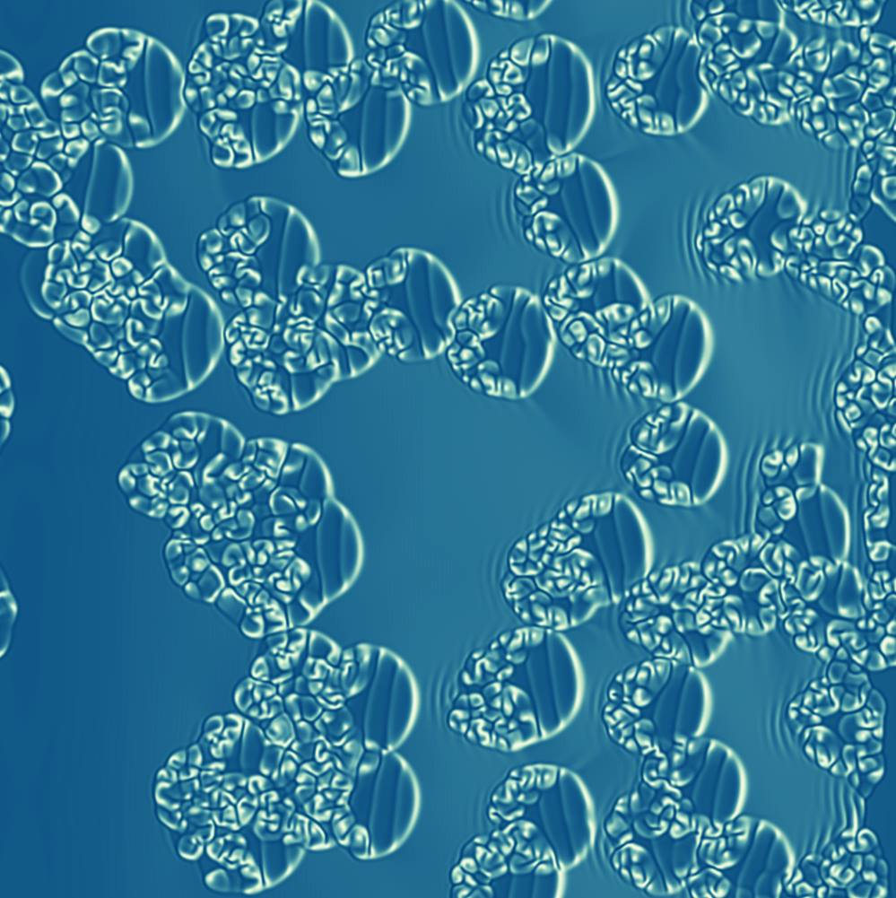
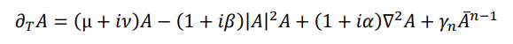

# CUDA based interactive simulation of Ginzburg-Landau equation with parametric forcing 
by Dr. Kjartan Pierre Emilsson

# Background

In 1994 I finished my Phd thesis under the supervision of professor Dr. Pierre Coullet from the University of Nice - Sophia Antipolis. The title of the thesis was "Strong Resonances in a Field of Oscillators and Bifurcation of Defects" and its subject was to investigate the patterns emerging in the two-dimensional Ginzburg-Landau equation in the presence of parametric forcing. 

There are two subjects in this thesis. In the first part, a qualitative method to 
classify and predict the structure of defects in reaction-diffusion systems is
introduced. This qualitative approach makes it easier to analyze the behavior
of defects in complex systems. It also gives us information about the inner 
structure of the defect, and from that point of view, it makes it possible to 
approach the concept of defect bifurcation in a novel manner. In the second 
part, we study the normal form governing the evolution of a spatially extended 
homogeneous temporal instability, in the presence of a temporal forcing. This 
is equivalent to studying strong resonances of a field of nonlinear oscillators. 
A detailed analysis of the phase space of this normal form reveals a rich 
dynamical structure, which gives rise to a variety of spatial structures. These 
include excitable pulses, excitable spirals, fronts and spatially periodic 
structures. These structures are studied and their possible bifurcations are 
analyzed from a qualitative point of view.

Link to [thesis](https://raw.githubusercontent.com/lekjart/ginzburg-landau/main/Thesis/GinzburgLandauParametric_KjartanEmilsson_Phd_Thesis.pdf)

# Simulation

At the time the simulations for this thesis were performed on a [Connection Machine](https://en.wikipedia.org/wiki/Connection_Machine) supercomputer from Thinking Machines, but 30 years later I rewrote it to run on CUDA based platforms so it runs very well on any Windows PC with a decent Nvidia GPU. Here you will find both a PDF version of the original thesis as well as the CUDA source code for the simulation.

Link to github [repo](https://github.com/lekjart/ginzburg-landau/)
